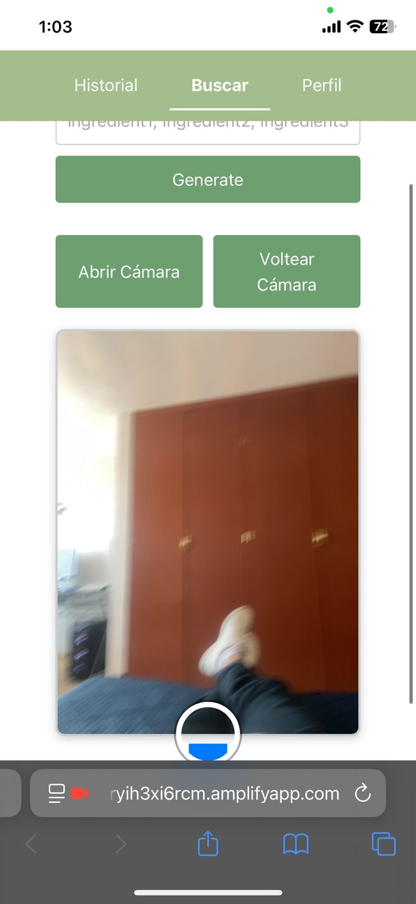

# Gastronome

This project is a web-based platform that suggests recipes based on ingredients detected through image recognition. Using an artificial intelligence model, users can upload photos of food and receive personalized recipe suggestions tailored to their dietary restrictions and culinary preferences. 

The main goal is to promote creative and sustainable cooking, reduce food waste, and support people with diverse lifestyles. 

The system is designed to be accessible, inclusive, and scalable — with future potential for integration into mobile apps, smart kitchen devices, and nutritional tracking tools.

To go to the site click the following url:

- [Gastronome](https://main.d1nryih3xi6rcm.amplifyapp.com/) 

There is also a Google Collab Notebook where the CNN was trained

- [Notebook](https://colab.research.google.com/drive/1_IwEZUM4N8vKmyE4awLKyxnwQrYUHXZM?usp=sharing) 

## Installation requirements

Please use the following command: 
    `git pull https://github.com/DaWaildHorse/Gastronome`

To host the project yourself, you need an AWS account to upload the project in amplify, or use any other web host you wish.

## UI & Project View

The webpage should look like this on your phone:

  

